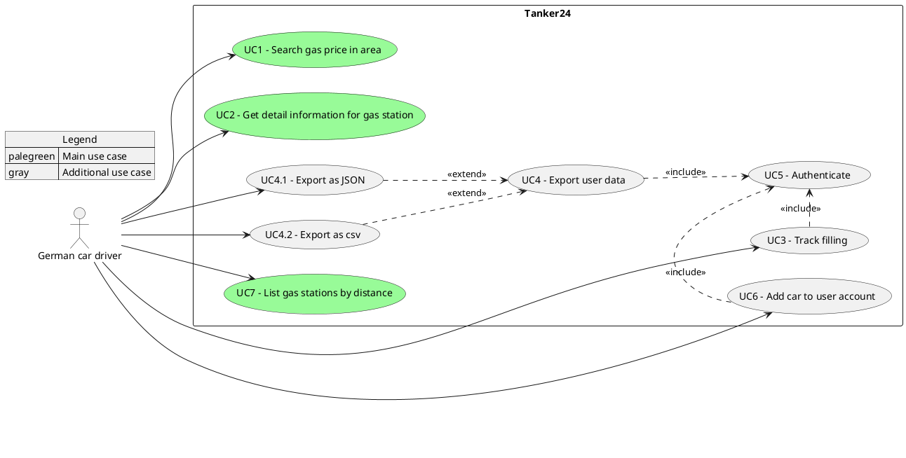

# 1. Introduction and Goals
This chapter describes the relevant requirements and the driving forces that influence the software architecture and development processes. The arc42 templates specificly mentions the following aspects:

- underlying business goals, essential features and functional requirements for the system,
- quality goals for the architecture,
- relevant stakeholders and their expectations

| Priority | System goal |
|-----------|-------|
|1|The system must enable users to search for gas stations in their area.|
|2|The system must visualize the gas price for Diesel, E5 and E10 fuel types in a listing as well|
|3| The system should enable the user to track it's fuel usage for multiple cars|
|4|The system must store the user data persistently| 

## 1.1 Requirements Overview
### Contents
Short description of the functional requirements, driving forces, extract (or abstract) of requirements. Links to the (hopefully existing) requirements documents, with information where to find it.

### Motivation
From the point of view of the end users a system is created or modified to improve support of a business activity and/or improve the quality.

### Form
Short textual description, probably in tabular use-case format. If requirements documents exist this overview should refer to these documents.

Keep these excerpts as short as possible. Balance readability of this document with potential redundancy w.r.t. requirements documents.

|Id|Description|
|---|---|
|UC1|Search for gas stations in the given area specified by latitude and longitude parameters.|
|UC2|The user retrieves detailed information about a selected gas station, such as location, available fuel types, and current prices.|
|UC3|The authenticated user records a fuel filling event, including details such as fuel amount, price, and associated vehicle.|
|UC4|The authenticated user exports their stored data (e.g., fuel history and vehicles) into a downloadable format for external use.|
|UC4.1|The authenticated user exports their data in JSON format for structured data processing or integration.|
|UC4.2|The authenticated user exports their data in CSV format for easy use in spreadsheet applications.|
|UC5|The user logs into the system to access protected features and manage personal data.|
|UC6|The authenticated user adds a new vehicle to their account to associate it with fuel tracking activities.|
|UC7|The user views a list of gas stations sorted by proximity to a specified location.|

## 1.2 Quality Goals
### Content
The top three (max five) quality goals for the architecture whose fulfillment is of highest importance to the major stakeholders. We really mean quality goals for the architecture. Don’t confuse them with project goals. They are not necessarily identical.

The ISO 25010 standard provides a nice overview of potential topics of interest:

ISO 25010 categories of quality requirements

### Motivation
You should know the quality goals of your most important stakeholders, since they will influence fundamental architectural decisions. Make sure to be very concrete about these qualities, avoid buzzwords. If you as an architect do not know how the quality of your work will be judged …

### Form
A table with the most important quality goals and concrete scenarios, ordered by priorities.

See section 10 (Quality Requirements) for a complete overview of quality scenarios.

## 1.3 Stakeholder
### Content
Explicit overview of stakeholders of the system, i.e. all person, roles or organizations that

should know the architecture
have to be convinced of the architecture
have to work with the architecture or with code
need the documentation of the architecture for their work
have to come up with decisions about the system or its development

### Motivation
You should know all parties involved in development of the system or affected by the system. Otherwise, you may get nasty surprises later in the development process. These stakeholders determine the extent and the level of detail of your work and its results.

### Form
Table with role names, person names, and their expectations with respect to the architecture and its documentation.

| Role/Name | Needs | Expectations |
|-----------|-------|--------------|
|German car driver|       |              |
|           |       |              |
