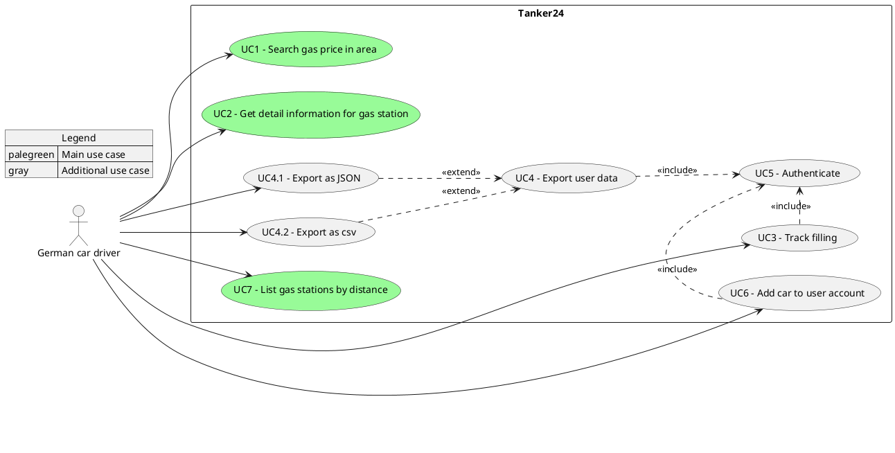

# 1. Introduction and Goals
This chapter describes the relevant requirements and the driving forces that influence the software architecture and development processes. The arc42 templates specificly mentions the following aspects:

- underlying business goals, essential features and functional requirements for the system,
- quality goals for the architecture,
- relevant stakeholders and their expectations

| Priority | System goal |
|-----------|-------|
|1|The system must enable users to search for gas stations in their area.|
|2|The system must visualize the gas price for Diesel, E5 and E10 fuel types in a listing as well|
|3| The system should enable the user to track it's fuel usage for multiple cars|
|4|The system must store the user data persistently| 

## 1.1 Requirements Overview

|Id|Description|
|---|---|
|UC1|Search for gas stations in the given area specified by latitude and longitude parameters.|
|UC2|The user retrieves detailed information about a selected gas station, such as location, available fuel types, and current prices.|
|UC3|The authenticated user records a fuel filling event, including details such as fuel amount, price, and associated vehicle.|
|UC4|The authenticated user exports their stored data (e.g., fuel history and vehicles) into a downloadable format for external use.|
|UC4.1|The authenticated user exports their data in JSON format for structured data processing or integration.|
|UC4.2|The authenticated user exports their data in CSV format for easy use in spreadsheet applications.|
|UC5|The user logs into the system to access protected features and manage personal data.|
|UC6|The authenticated user adds a new vehicle to their account to associate it with fuel tracking activities.|
|UC7|The user views a list of gas stations sorted by proximity to a specified location.|

## 1.2 Quality Goals
The ISO  25010 specifies the eight quality goals goals for software applications. They are: Functional Stability, Reliability, Security, Maintainability, Performance Efficiency, Operability, Compatibility, Transferability. 

|Prio|Quality Goal|Description|
|----|------------|-----------|
|1|Functional Stability|The software shall cover all specified main use cases.|
|2|Reliability|The software shall seamlessly recover from tankerkoenig API outages.|
|3|Security| The software shall protect the collected user data with authentication.|
|4|Transferability|The software shall allow the user to transfer its collected user data (filling data) into JSON and csv.|

## 1.3 Stakeholder
| Role/Name | Needs | Expectations |
|-----------|-------|--------------|
|German car driver|Find the cheapest gas station in their area.|Accurate and up-to-date fuel prices, fast search results, and easy comparison of nearby stations.|
|Foreign drivers new to Germany|Find the closest gas station to their location.|Simple and intuitive interface and integration into common navigation apps. |
