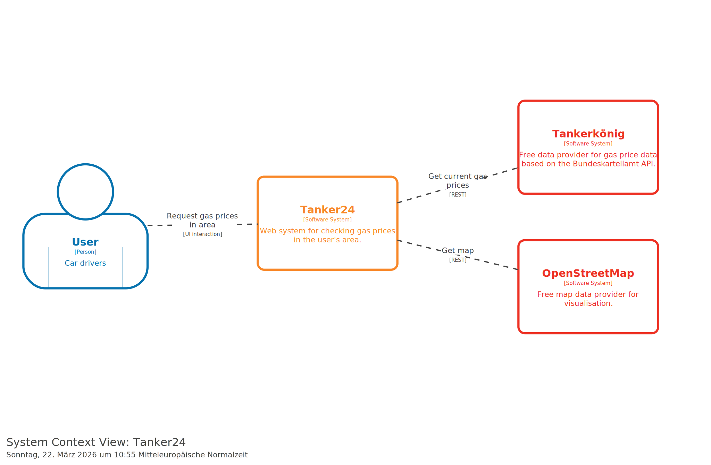

# 3. Context and Scope

## 3.1 Business Context

Tanker24 is a web application designed for German car drivers to check real-time fuel prices at gas stations in their vicinity and track their fuel expenditures over time. Gas prices in Germany are regulated by the Market Transparency Unit for Fuels (MTS-K), which publishes prices via a public API. Tanker24 integrates with the Tankerkönig API — a free, community-driven service that proxies the MTS-K data — to provide up-to-date station and price information.

The application fills a gap in the market for a free, privacy-respecting fuel price comparison tool that also offers personal expenditure tracking. Unlike commercial alternatives, Tanker24 requires no payment, no third-party analytics, and gives users full control over their data via JSON and CSV export.

## 3.2 System Scope

The system context and scope is described with a C4-Model System Context (Level 1) diagram. It displays all interacting partners at a high level while specifying the required interfaces to users and external systems.

**In scope (Tanker24):**
- User authentication and registration (invitation-key based)
- Search for gas stations by geographic coordinates
- Display of fuel prices (Diesel, E5, E10) sorted by distance
- Tracking fuel filling events for multiple cars
- Export of user data (fueling history, cars) as JSON and CSV

**Out of scope:**
- Payment processing for fuel purchases
- Navigation/routing to gas stations
- Native mobile applications (Android/iOS)
- Integration with vehicle telemetry systems
- Administrative dashboard for user management
- Geocoding (address-to-coordinate conversion)

## 3.3 System Context Diagram (C4-Model Level 1)

=== "PlantUML"
    ```puml
    @startuml C4_Elements
    !include https://raw.githubusercontent.com/plantuml-stdlib/C4-PlantUML/master/C4_Context.puml

    Person(user, "User", "German car driver")
    System(tanker24, "Tanker24", "Web system for checking gas prices in the users area.")
    System_Ext(tankerkoenig, "Tankerkönig", "Free data provider for gas price data based on the Bundeskartelamt API.")
    System_Ext(osm, "OpenStreetMap", "Free map data provider for visualisation.")
    Rel_R(user, tanker24, "Request gas prices for area.", "Web Interface")
    Rel_R(user, tanker24, "Save filling history.", "Web Interface")
    Rel_R(tanker24, tankerkoenig, "Request gas price Data", "REST")
    Rel(tanker24, osm, "Request map data", "REST")
    @enduml
    ```

=== "Structurizr"
    

## 3.4 External Interface Summary

| Interface | Provider | Direction | Protocol | Data |
|---|---|---|---|---|
| Tanker24 Web UI | User → Tanker24 | Inbound | HTTPS | User requests, form submissions |
| Tankerkönig API | Tanker24 → Tankerkönig | Outbound | REST/JSON | Gas station lists, prices, opening times |
| OpenStreetMap Tiles | Tanker24 → OSM | Outbound | HTTPS | Raster map tiles (light/dark) |
