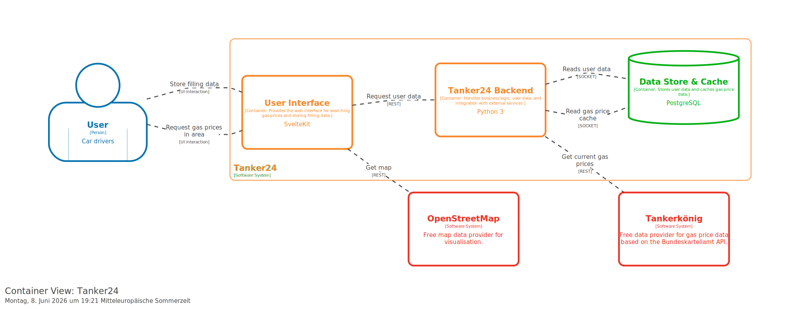

# 4. Solution strategy
This chapter describes the fundamental architecture decisions made by the project team. These decisions shape the architecture of our product.

## Container Diagram (C4-Model Level 2)
The container diagram shows how Tanker24 is structured internally without putting too big a focus on implementation details.
=== "PlantUML"
    ```puml
    @startuml
    !include https://raw.githubusercontent.com/plantuml-stdlib/C4-PlantUML/master/C4_Container.puml

    !define osaPuml https://raw.githubusercontent.com/Crashedmind/PlantUML-opensecurityarchitecture2-icons/master
    !include osaPuml/Common.puml
    !include osaPuml/User/all.puml

    !include <office/Servers/database_server>
    !include <office/Servers/file_server>
    !include <office/Servers/application_server>
    !include <office/Concepts/service_application>
    !include <office/Concepts/firewall>

    AddPersonTag("customer", $sprite="osa_user_large_group", $legendText="aggregated user")

    AddContainerTag("webApp", $sprite="application_server", $legendText="web app container")
    AddContainerTag("db", $sprite="database_server", $legendText="database container")
    AddContainerTag("conApp", $sprite="service_application", $legendText="console app container")

    Person_Ext(user, "German car drivers", $tags= "customer")

    System_Boundary(tanker24Application, "Tanker24"){
        Container(web_app, "User Interface", "SvelteKit", $tags="webApp")
        ContainerDb(postgre, "Data Store & Cache", "PostgreSQL", $tags="db")
        Container(backend, "Tanker24 Backend", "Python 3", $tags="conApp")

        Rel_D(web_app, backend, "Request user data", "REST")
        Rel_L(backend, postgre, "Reads user data", "SOCKET")
        Rel_L(backend, postgre, "Read gas price cache", "SOCKET")
    }

    Rel(user, web_app, "Request gas prices in area.", "UI interaction")
    Rel(user, web_app, "Store filling data", "UI interaction")

    Container_Ext(tankerkoenig, "Tankerkönig", $tags="conApp")
    Rel_R(backend, tankerkoenig, "Get current gas prices", "REST")
    Container_Ext(osm, "OpenStreetMap", $tags= "conApp")
    Rel_R(web_app,osm,"Get map", "REST")

    @enduml
    ```

=== "Structurizr"
    


## Technology decisions
As per organizational constraint OC-3 all relevant technology decisions need to be documented as architecture decision records (ADR). The following page lists all ADRs: [here](../decisions/index.md) To ensure the quality of the ADRs they use a shared comprehensive template.

## Quality Goals

The following table maps the quality goals from [Section 1.2](01_intro_goals.md#12-quality-goals) to concrete solution approaches implemented in the architecture.

|Quality Goal|Scenario|Solution approach|Link to Details|
|--|---|--|--|
|Functional Stability|All main use cases must be covered.|Implement Test-Driven Development (TDD) with pytest and Playwright E2E tests. CI pipeline enforces passing tests before merge.|[Test Concept](../testConcept.md)|
|Reliability|The Tankerkoenig data API is unavailable.|Implement caching of station data in PostgreSQL to serve location information even without live price data.|[Section 8.4](08_crosscutting_concepts.md#84-caching-strategy)|
|Reliability|The Tankerkoenig data API returns errors or times out.|Implement graceful degradation: catch exceptions, log them, return an empty station list without propagating 500 errors.|[Section 6.1](06_runtime_view.md#61-scenario-search-nearby-gas-stations-uc1-uc7)|
|Security|A user requests user-specific data.|Implement JWT-based authentication via fastapi-users library. All protected endpoints require a valid bearer token.|[Section 8.2](08_crosscutting_concepts.md#82-authentication-and-authorization)|
|Transferability|The user wants to export their data as JSON.|NestedExportDataService builds hierarchical JSON (cars → history records) and returns it with Content-Disposition header for download.|[Section 5.2.2](05_building_block_view.md#522-service-layer)|
|Transferability|The user wants to export their data as a semicolon-separated CSV.|FlatExportDataService flattens data into CSV rows (one per history record) using Python's csv.DictWriter with semicolon delimiter.|[Section 5.2.2](05_building_block_view.md#522-service-layer)|
