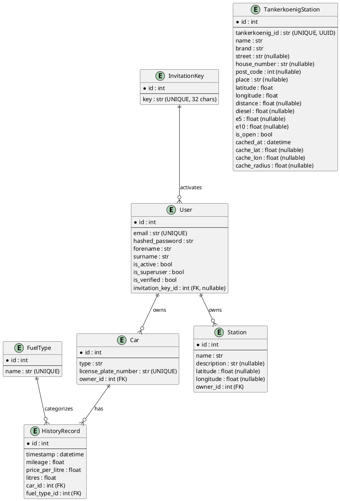

# 5. Building Block View

The following figure shows the internal structure of Tanker24 at C4-Model Level 2 (Container) and Level 3 (Component).

## 5.1 Whitebox Overall System (Level 1)

Tanker24 is composed of four main building blocks:

```puml
@startuml
!include https://raw.githubusercontent.com/plantuml-stdlib/C4-PlantUML/master/C4_Container.puml

System_Boundary(tanker24, "Tanker24") {
    Container(frontend, "Frontend", "SvelteKit / Node.js 24", "Provides the web-based user interface with interactive map, station search, and account management.")
    Container(backend, "Backend", "Python 3.14 / FastAPI", "RESTful API serving gas station data, user management, and data export.")
    ContainerDb(postgres, "Database", "PostgreSQL 18", "Persistent storage for user accounts, cars, history records, invitation keys, and gas station cache.")
    Container(uptime, "Monitoring", "Uptime Kuma 2", "Uptime and health monitoring dashboard for the deployed services.")
}

Person(user, "German Car Driver", "End user of the application.")
System_Ext(tankerkoenig, "Tankerkönig API", "External REST API providing real-time gas price data from the German Market Transparency Unit for Fuels (MTS-K).")
System_Ext(osm, "OpenStreetMap", "Public tile server providing raster map tiles for visualization.")
System_Ext(osm_dark, "CartoDB Dark Matter", "Public tile server providing dark-theme map tiles.")

Rel(user, frontend, "Checks gas prices, tracks fillings", "HTTPS")
Rel(frontend, backend, "API calls for data", "REST/HTTPS")
Rel(backend, postgres, "Reads/writes persistent data", "SQL/TCP")
Rel(backend, tankerkoenig, "Fetches gas price data", "REST/HTTPS")
Rel(frontend, osm, "Loads map tiles (light theme)", "HTTPS")
Rel(frontend, osm_dark, "Loads map tiles (dark theme)", "HTTPS")
@enduml
```

| Building Block | Description |
|---|---|
| **Frontend** | SvelteKit application (Svelte 5) with TypeScript, TailwindCSS 4, and Leaflet for interactive maps. Communicates exclusively with the backend via REST API. Renders map tiles directly from OpenStreetMap/CDN tile servers. |
| **Backend** | FastAPI application written in Python 3.14. Provides REST endpoints for station data, user authentication, and data export. Implements caching, rate limiting, and integration with the Tankerkönig external API. |
| **PostgreSQL** | Relational database (v18) used for persistent storage. Stores user accounts, vehicles, fueling history records, invitation keys, and cached gas station data from the Tankerkönig API. |
| **Uptime Kuma** | Lightweight monitoring service that periodically checks the health of the frontend and backend services and provides a dashboard for uptime status. |

## 5.2 Backend — Component View (Level 3)

The backend follows a layered architecture with clear separation of concerns:

```puml
@startuml
!include https://raw.githubusercontent.com/plantuml-stdlib/C4-PlantUML/master/C4_Component.puml

Container_Boundary(backend, "Backend (FastAPI / Python)") {

    Component(routers, "Routers", "FastAPI Router", "Exposes REST endpoints, validates request parameters, handles HTTP errors.")

    Component(services, "Services", "Business Logic Layer", "Orchestrates business operations: station search, export, rate limiting.")

    Component(repositories, "Repositories", "Data Access Layer", "Encapsulates all database queries via SQLAlchemy async sessions.")

    Component(models_orm, "ORM Models", "SQLAlchemy Models", "Defines the database schema: User, Car, HistoryRecord, TankerkoenigStation, InvitationKey.")

    Component(schemas, "Schemas", "Pydantic Models", "Defines API request/response schemas for validation and serialization.")

    Component(auth_module, "Auth Module", "fastapi-users + JWT", "Handles user registration, login, JWT token generation/validation, password policies.")

    Component(limiter, "Rate Limiter", "SlowAPI + Token Bucket", "Enforces per-user and per-endpoint rate limits. Uses in-memory token bucket for Tankerkönig API calls.")

    Component(cache, "Station Cache", "PostgreSQL-based", "Caches Tankerkönig API responses with spatial and temporal tolerance to reduce external API calls.")

    Component(logging, "Logging", "Python logging + stdout", "Structured logging with timestamps, log levels, and module names. Configured at application startup.")
}

ContainerDb(postgres, "PostgreSQL", "Relational Database")
Container_Ext(tankerkoenig, "Tankerkönig API", "External Gas Price API")

Rel(routers, services, "Calls business logic", "Python method call")
Rel(services, repositories, "Reads/writes data", "Python method call")
Rel(repositories, postgres, "SQL queries", "async SQLAlchemy/TCP")
Rel(services, cache, "Writes/reads cached stations", "via Repository")
Rel(services, tankerkoenig, "Fetches gas prices on cache miss", "REST/HTTPS")
Rel(routers, auth_module, "Protects endpoints", "FastAPI Depends")
Rel(routers, limiter, "Applies rate limits", "SlowAPI decorator")
Rel(routers, schemas, "Validates I/O", "Pydantic validation")
Rel(repositories, models_orm, "Uses ORM mappings", "SQLAlchemy")

@enduml
```

### 5.2.1 Router Layer

| Router | Prefix | Purpose |
|---|---|---|
| `health.py` | `/` | Health check (`/health`) and root welcome endpoint (`/`). Unauthenticated. |
| `auth.py` | `/api/v0/auth/jwt`, `/api/v0/users` | Login/JWT token, registration, user profile management. Powered by fastapi-users. |
| `stations.py` | `/api/v0/stations` | CRUD for user-owned stations, nearby station search with caching. Most endpoints require authentication. |
| `export.py` | `/api/v0/export` | JSON and CSV export of user's car and fueling history data. Requires authentication. |

### 5.2.2 Service Layer

| Service | Responsibility |
|---|---|
| `GasStationService` (abstract) | Interface for gas station data providers. Currently implemented by `TankerkoenigGasStationService`. |
| `TankerkoenigGasStationService` | Communicates with the Tankerkönig REST API (`creativecommons.tankerkoenig.de/json/`). Supports area search (`list.php`) and detail lookup (`detail.php`). |
| `NearbyStationsService` | Orchestrates station search with caching: checks the database cache first; on miss, calls the API, applies rate limiting, and updates the cache. |
| `StationService` | CRUD operations for user-created station records. |
| `ExportDataService` (abstract) | Interface for data export. Implemented by `NestedExportDataService` (JSON) and `FlatExportDataService` (CSV). |
| `RateLimiter` | Token-bucket-based rate limiter for Tankerkönig API calls. Configured at 100 requests per minute. |

### 5.2.3 Repository Layer

| Repository | Entity | Key Operations |
|---|---|---|
| `StationRepository` | `Station` | CRUD scoped to owner |
| `TankerkoenigStationRepository` | `TankerkoenigStation` | Cache lookup with spatial tolerance, upsert with stale record cleanup |
| `CarRepository` | `Car` | Query cars by owner |
| `HistoryRecordRepository` | `HistoryRecord` | Query history records by car |
| `InvitationKeyRepository` | `InvitationKey` | CRUD for invitation keys, lookup users by key |

### 5.2.4 Data Model (ORM)

The database schema is defined in `backend/app/models.py` using SQLAlchemy declarative models:



## 5.3 Frontend — Component View (Level 3)

The frontend follows SvelteKit's file-based routing pattern with a service/stores layer:

```puml
@startuml
!include https://raw.githubusercontent.com/plantuml-stdlib/C4-PlantUML/master/C4_Component.puml

Container_Boundary(frontend, "Frontend (SvelteKit)") {

    Component(routes, "Routes & Pages", "Svelte Pages", "File-based routing: home, map, login, register, account, impressum, privacy.")

    Component(components, "UI Components", "Svelte Components", "Reusable UI elements: Navbar, Footer, Button, Logo, ConsentModal, AuthRequiredModal, LanguageSwitcher.")

    Component(services, "API Services", "TypeScript Modules", "Typed wrappers for backend REST calls: auth_api, stations_api, export_api.")

    Component(utils, "Utilities", "request.ts", "Centralized fetch wrapper with base URL, auth token injection, and error handling.")

    Component(stores, "Stores", "Svelte Stores", "Reactive state: fuelType, locale (i18n), privacy consent, theme (light/dark).")

    Component(i18n, "i18n", "Internationalization", "Translation system supporting English and German using svelte-i18n.")
}

Container_Ext(backend, "Backend API", "REST/HTTPS")
Container_Ext(osm_tiles, "Map Tile Servers", "OpenStreetMap / CartoDB")

Rel(routes, components, "Composes UI", "Svelte imports")
Rel(routes, services, "Calls backend", "TypeScript method call")
Rel(services, utils, "Uses HTTP wrapper", "TypeScript import")
Rel(services, backend, "REST API calls", "HTTPS/JSON")
Rel(routes, stores, "Reads/writes state", "Svelte store subscription")
Rel(routes, i18n, "Translates UI", "svelte-i18n")
Rel(routes, osm_tiles, "Renders map tiles", "HTTPS (Leaflet)")
@enduml
```

### 5.3.1 Route Structure

| Route | Page | Description |
|---|---|---|
| `/` | `+page.svelte` | Landing page with project introduction |
| `/map` | `+page.svelte` | Interactive map for searching nearby gas stations |
| `/login` | `+page.svelte` | User login form |
| `/register` | `+page.svelte` | User registration with invitation key |
| `/account` | `+page.svelte` | User account management |
| `/impressum` | `+page.svelte` | Legal imprint (German requirement) |
| `/privacy` | `+page.svelte` | Privacy policy |

### 5.3.2 Key Dependencies

| Library | Version | Purpose |
|---|---|---|
| Svelte / SvelteKit | 5 | UI framework and full-stack routing |
| Tailwind CSS | 4 | Utility-first CSS styling |
| Leaflet | 1.x | Interactive map rendering with marker support |
| svelte-i18n | latest | Internationalization (English, German) |
| Playwright | latest | End-to-end browser testing |
| Vitest | latest | Unit testing framework |
| Vite | latest | Build tool and development server |

## 5.4 External Interfaces

| Interface | Provider | Protocol | Purpose |
|---|---|---|---|
| Tankerkönig API | `creativecommons.tankerkoenig.de` | REST/JSON over HTTPS | Retrieves gas station lists (area search) and details (by ID) |
| OpenStreetMap Tiles | `tile.openstreetmap.org` | HTTPS | Standard raster map tiles (light theme) |
| CartoDB Dark Matter | `basemaps.cartocdn.com` | HTTPS | Dark raster map tiles (dark theme) |
| GitHub Container Registry | `ghcr.io` | Docker Registry API | Hosts built container images for deployment |
| SonarCloud | `sonarcloud.io` | REST/HTTPS | Static code analysis and quality gate |
| ReadTheDocs | `readthedocs.io` | HTTPS | Hosts MkDocs-based project documentation |