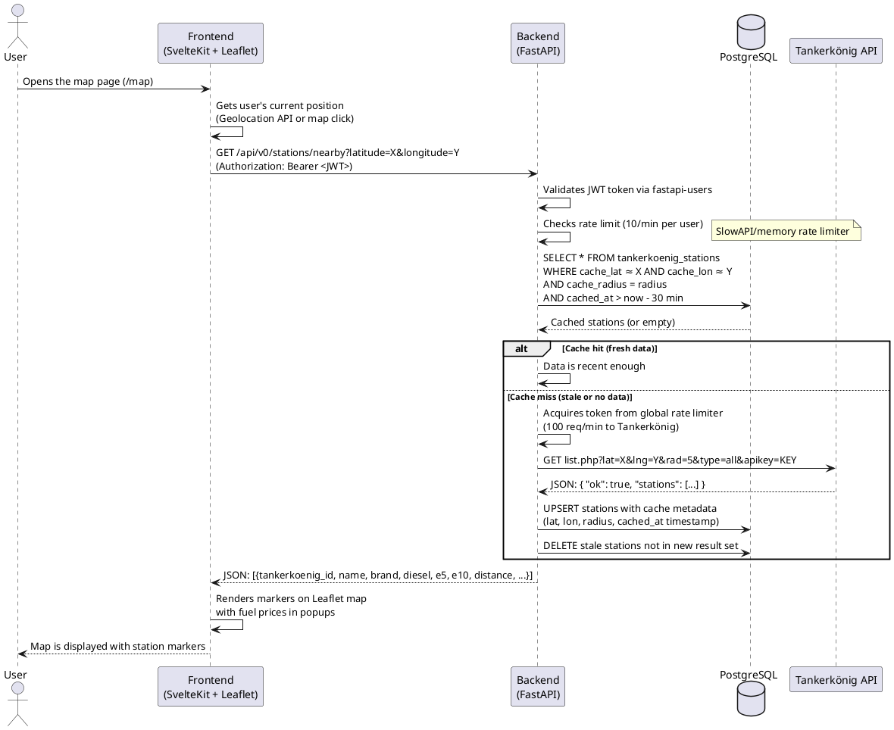
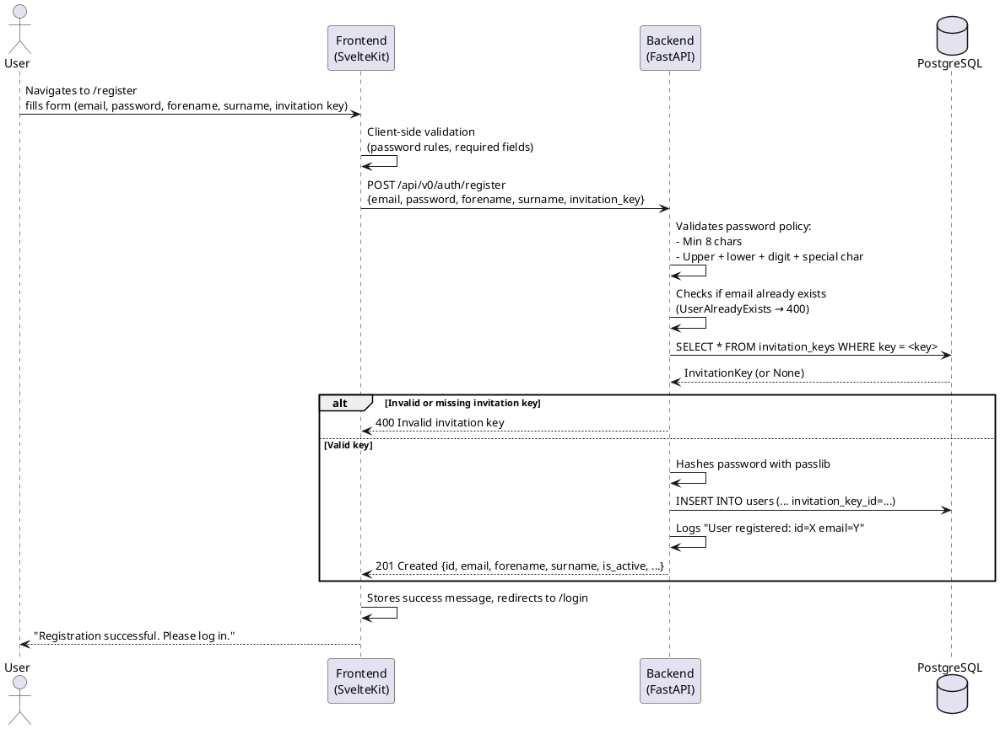
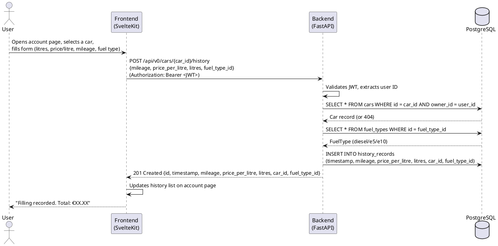
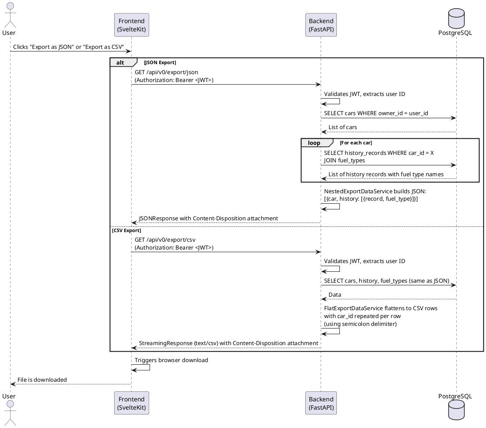
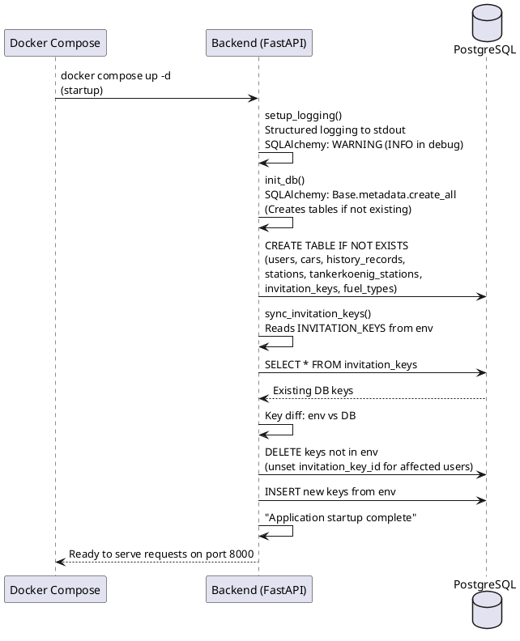

# 6. Runtime View

This chapter describes the runtime behavior of Tanker24 by documenting the most important usage scenarios as sequence diagrams. Each scenario illustrates the interaction between the user, frontend, backend, database, and external systems.

## 6.1 Scenario: Search Nearby Gas Stations (UC1, UC7)

The user opens the map page, selects a location, and the system returns nearby gas stations with current prices.

**Steps:**
1. User navigates to `/map`; the SvelteKit frontend loads the Leaflet map component.  
2. The user selects a location (via geolocation or map click).  
3. Frontend sends `GET /api/v0/stations/nearby?latitude=X&longitude=Y` with the JWT token in the `Authorization` header.  
4. Backend validates the JWT and checks the user-based rate limit (10 requests per minute).  
5. Backend queries the `tankerkoenig_stations` cache table for matching entries within the configured tolerance (0.01 km) and expiry (30 minutes).  
6. **If cache hit:** cached stations are returned directly.  
7. **If cache miss:** the backend acquires a token from the global Tankerkönig rate limiter (100 requests/minute), then calls the Tankerkönig `list.php` API. Results are upserted into the cache with metadata (search coordinates, radius, timestamp). Stale entries from previous searches are cleaned up.  
8. Backend returns the station list as JSON with fuel prices and distances.  
9. Frontend renders station markers on the Leaflet map with price information.  

**Error Handling:**
- If the Tankerkönig API is unavailable, the service catches the exception, logs it, and returns an empty list (graceful degradation).
- If the user exceeds the rate limit, a `429 Too Many Requests` response is returned.
- If `latitude` or `longitude` are out of valid range, a `400 Bad Request` is returned.

## 6.2 Scenario: User Registration (UC5, UC6)

A new user registers with an invitation key.

## 6.3 Scenario: Record Fuel Filling (UC3)

An authenticated user records a fuel filling event for one of their cars.

## 6.4 Scenario: Export User Data (UC4)

The authenticated user exports their fueling history as JSON or CSV.

## 6.5 Scenario: Application Startup

**Startup Steps:**
1. Docker Compose starts the backend container (after PostgreSQL is healthy).  
2. `lifespan` context manager calls `setup_logging()` to configure structured logging.  
3. `init_db()` runs `Base.metadata.create_all` to create any missing tables (idempotent).  
4. `sync_invitation_keys()` reads the `INVITATION_KEYS` environment variable (comma-separated 32-char hex strings), diff against the DB, removes expired keys, and adds new ones. Users with deleted keys have their `invitation_key_id` set to `NULL`.  
5. The application starts serving requests on port 8000.  