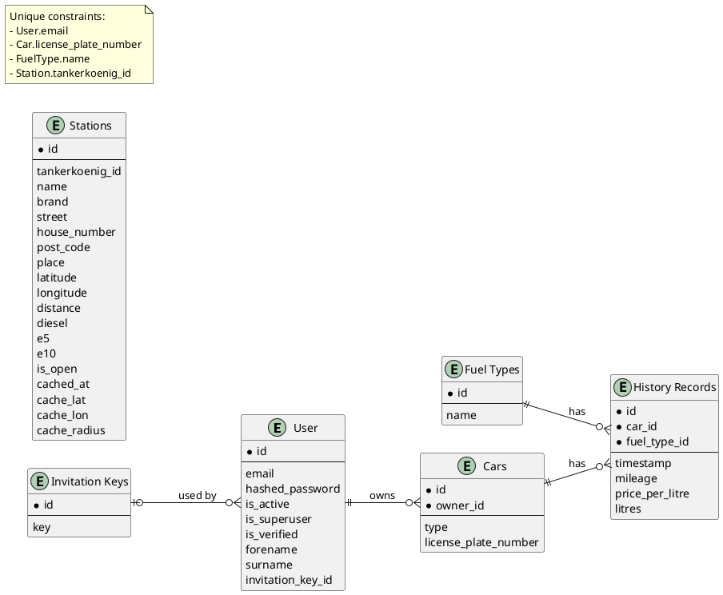

# Entity-Relationship Model

```puml
@startuml
left to right direction

entity "User" as User {
  *id
  --
  email
  hashed_password
  is_active
  is_superuser
  is_verified
  forename
  surname
  invitation_key_id
}

entity "Cars" as Car {
  *id
  *owner_id
  --
  type
  license_plate_number
}

entity "Fuel Types" as FuelType {
  *id
  --
  name
}

entity "History Records" as HistoryRecord {
  *id
  *car_id
  *fuel_type_id
  --
  timestamp
  mileage
  price_per_litre
  litres
}

entity "Stations" as Station {
  *id
  --
  tankerkoenig_id
  name
  brand
  street
  house_number
  post_code
  place
  latitude
  longitude
  distance
  diesel
  e5
  e10
  is_open
  cached_at
  cache_lat
  cache_lon
  cache_radius
}

entity "Invitation Keys" as InvitationKeys{
  *id
  --
  key
}

InvitationKeys |o--o{ User : used by
User ||--o{ Car : owns
Car ||--o{ HistoryRecord : has
FuelType ||--o{ HistoryRecord : has

note "Unique constraints:\n- User.email\n- Car.license_plate_number\n- FuelType.name\n- Station.tankerkoenig_id" as N1

@enduml
```