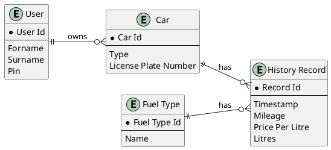

# Entity-Relationship Model

```puml
@startuml
left to right direction

entity "User" as User {
  *User Id
  --
  Forname
  Surname
  Pin
}

entity "Car" as Car {
  *Car Id
  --
  Type
  License Plate Number
}

entity "Fuel Type" as FuelType {
  *Fuel Type Id
  --
  Name
}

entity "History Record" as HistoryRecord {
  *Record Id
  --
  Timestamp
  Mileage
  Price Per Litre
  Litres
}

User ||--o{ Car : owns
Car ||--o{ HistoryRecord : has
FuelType ||--o{ HistoryRecord : has

@enduml
```

