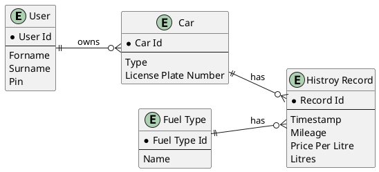
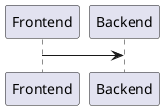

<!-- omit from toc -->
# Welcome to Tanker24's documentation!

!!! note

    This project is under active development.

Check out the [usage](usage) section for further information, including how to [install](installation) the project.

## Project Vision
With Tanker24 we want to show case Software Quality Assurance methods on an important real world tool. As gas prices rise in Germany many people use Apps or Websites to check gas prices in their area. Tank24 will implement such a website and enable users to track their gas price history.

!!! abstract "System Vision"


    For german car drivers who need to check gas prices Tanker24 is a web service that allows them to see all real time gas prices in their vicinity and track their expendures. 

The system vision schema is based on: G. Beneken, F. Hummel und M. Kucich, Grundkurs agiles Software-Engineering: Ein Handbuch für Studium und Praxis. Wiesbaden, Germany: Springer Vieweg, 2022. doi: 10.1007/978-3-658-37371-9

## Class model
### ER-Diagram



### System Context Diagram (C4-Model Level 1)
```puml
@startuml C4_Elements
!include https://raw.githubusercontent.com/plantuml-stdlib/C4-PlantUML/master/C4_Context.puml

Person(user, "User", "German car driver")
System(tanker24, "Tanker24", "Web system for checking gas prices in the users area.")
System_Ext(tankerkoenig, "Tankerkönig", "Free data provider for gas price data based on the Bundeskartelamt API.")
System_Ext(osm, "OpenStreeMap", "Free map data provider for visualisation.")
Rel_R(user, tanker24, "Request gas prices for area.", "Web Interface")
Rel_R(user, tanker24, "Save filling history.", "Web Interface")
Rel_R(tanker24, tankerkoenig, "Request gas price Data", "REST")
Rel(tanker24, osm, "Request map data", "REST")
@enduml
```
### Container Diagram (C4-Model Level 2)
```puml
@startuml
!include https://raw.githubusercontent.com/plantuml-stdlib/C4-PlantUML/master/C4_Container.puml

!define osaPuml https://raw.githubusercontent.com/Crashedmind/PlantUML-opensecurityarchitecture2-icons/master
!include osaPuml/Common.puml
!include osaPuml/User/all.puml

!include <office/Servers/database_server>
!include <office/Servers/file_server>
!include <office/Servers/application_server>
!include <office/Concepts/service_application>
!include <office/Concepts/firewall>

AddPersonTag("customer", $sprite="osa_user_large_group", $legendText="aggregated user")

AddContainerTag("webApp", $sprite="application_server", $legendText="web app container")
AddContainerTag("db", $sprite="database_server", $legendText="database container")
AddContainerTag("conApp", $sprite="service_application", $legendText="console app container")

Person_Ext(user, "German car drivers", $tags= "customer")

System_Boundary(tanker24Application, "Tanker24"){
    Container(web_app, "User Interface", "VueJS", $tags="webApp")
    ContainerDb(postgre, "Data Store & Cache", "PostgreSQL", $tags="db")
    Container(backend, "Tanker24 Backend", "Python 3", $tags="conApp")

    Rel_D(web_app, backend, "Request user data", "REST")
    Rel_L(backend, postgre, "Reads user data", "SOCKET")
    Rel_L(backend, postgre, "Read gas price cache", "SOCKET")
}

Rel(user, web_app, "Request gas prices in area.", "UI interaction")
Rel(user, web_app, "Store filling data", "UI interaction")

Container_Ext(tankerkoenig, "Tankerkönig", $tags="conApp")
Rel_R(backend, tankerkoenig, "Get current gas prices", "REST")
Container_Ext(osm, "OpenStreetMap", $tags= "conApp")
Rel_R(web_app,osm,"Get map", "REST")

@enduml
```

## 🔧 Application Logic


