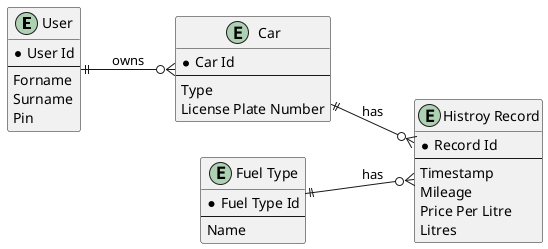
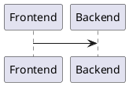

<!-- omit from toc -->
# Welcome to Tanker24's documentation!

!!! note

    This project is under active development.

Check out the [usage](usage) section for further information, including how to [install](usage#installation) the project.

<!-- omit from toc -->
## Table of Contents
- [Project Vision](#project-vision)
- [Class model](#class-model)
  - [ER-Diagram](#er-diagram)
- [🔧 Application Logic](#-application-logic)

## Project Vision
With Tanker24 we want to show case Software Quality Assurance methods on an important real world tool. As gas prices rise in Germany many people use Apps or Websites to check gas prices in their area. Tank24 will implement such a website and enable users to track their gas price history.

!!! abstract "System Vision"

    For german car drivers who need to check gas prices Tanker24 is a web service that allows them to see all real time gas prices in their vicinity and track their expendures. 

The system vision schema is based on: G. Beneken, F. Hummel und M. Kucich, Grundkurs agiles Software-Engineering: Ein Handbuch für Studium und Praxis. Wiesbaden, Germany: Springer Vieweg, 2022. doi: 10.1007/978-3-658-37371-9

## Class model
### ER-Diagram

## 🔧 Application Logic

