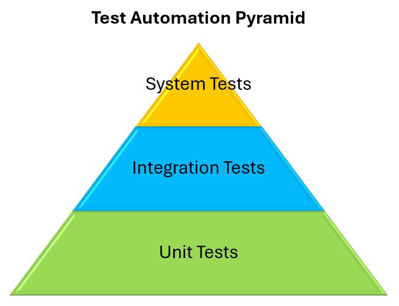

# Test Concept

The project needs to reach at least 80% code coverage and include tests from all levels of the **test automation pyramid**.

## Github Pipeline for Test Execution
todo

## Unit Tests

## Integration Tests

## System Tests
### e2e Tests
The End-to-End Tests are created with a tool called Playwright. Playwright enables us to automatically test the front end of our application via its chromium based browser.

### Smoke Tests
